# شبکه‌ی دانشگاه هوشمند — شبیه‌سازی با Cisco Packet Tracer

> طراحی و پیاده‌سازی یک **شبکه‌ی دانشگاهی هوشمند** و افزونه‌دار در چند ساختمان، همراه با سرویس‌های اصلی شبکه، یک **کنسول مدیریت شبکه**، و یک بخش امتیازی **سامانه‌ی مدیریت بحران مرکز داده (IoT)**.

نسخه‌ی انگلیسی: [English README](README.md)

---

## معرفی پروژه

این پروژه زیرساخت کامل شبکه‌ی یک دانشگاه را با چهار ساختمان اصلی شبیه‌سازی می‌کند:

- ساختمان آموزشی
- ساختمان اداری
- کتابخانه
- مرکز داده (Data Center)

ارتباط میان این چهار ساختمان با **چهار روتر** و پروتکل مسیریابی **OSPF** برقرار شده است. توپولوژی به‌صورت حلقه‌ای (`R0 – R1 – R2 – R3 – R0`) طراحی شده تا در صورت قطع هر لینک، ترافیک به‌صورت خودکار از مسیر جایگزین عبور کند.

علاوه بر شبکه، یک **کنسول مدیریت شبکه‌ی دانشگاه** که با قابلیت برنامه‌نویسی Packet Tracer ساخته شده، وضعیت سرویس‌های اصلی را به‌صورت لحظه‌ای پایش می‌کند.

در کنار این‌ها، یک بخش امتیازی جداگانه نیز پیاده‌سازی شده که یک سامانه‌ی هوشمند مدیریت بحران برای مرکز داده است.

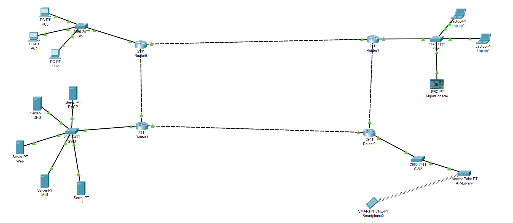

---

## ویژگی‌ها

### زیرساخت شبکه
- چهار روتر (مدل Cisco ISR 2911) در یک حلقه‌ی افزونه‌دار که با پروتکل OSPF (ناحیه‌ی 0) مسیریابی می‌شود.
- حداقل چهار شبکه‌ی محلی (LAN) مستقل، یکی برای هر ساختمان، با آدرس‌دهی صحیح.
- لینک‌های بین روترها با ماسک `/30` و شبکه‌ی مرکز داده با ماسک `/24` پیکربندی شده است.
- تست افزونگی (Redundancy) با پینگ پیوسته و دستورات `tracert` و `show ip route` تأیید شده است.

### سرویس‌های اصلی مرکز داده
- سرویس DHCP با یک Pool مجزا برای هر شبکه و تنظیم `ip helper-address` روی هر روتر.
- سرویس DNS برای ترجمه‌ی نام‌های `www.university.local` و `mail.university.local` و `ftp.university.local`.
- سرویس Web با یک صفحه‌ی اختصاصی «Smart University».
- سرویس Mail (پروتکل‌های SMTP و POP3) با حساب‌های کاربری زیر دامنه‌ی `university.com`.
- سرویس File / FTP برای آپلود و دانلود فایل‌های آموزشی.
- اتصال بی‌سیم برای گوشی هوشمند در کتابخانه از طریق Access Point (با WPA2-PSK و DHCP).

### کنسول مدیریت شبکه
ابزار پایش شبکه که با قابلیت برنامه‌نویسی Packet Tracer ساخته شده، در دو نسخه ارائه شده است:
- نسخه‌ی متنی (`network-console.py`) که یک منوی متنی دارد، وضعیت هر سرویس را بررسی می‌کند و گزارش Online / Offline و خلاصه‌ی کلی را چاپ می‌کند.
- نسخه‌ی گرافیکی (داشبوردهای HTML/JS) که وضعیت سرویس‌ها را به‌صورت کارت‌های زنده نمایش می‌دهد.

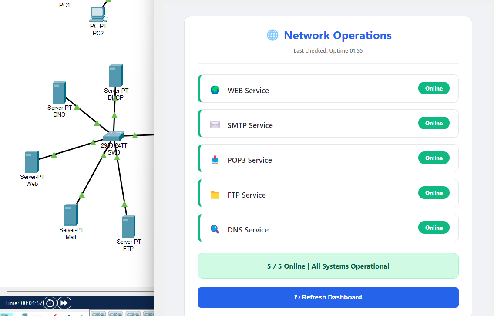

### بخش امتیازی — سامانه‌ی مدیریت بحران مرکز داده (IoT)
کنترل‌کننده‌ی IoT (فایل `disaster-recovery-controller.py`) که به شرایط اضطراری در مرکز داده واکنش نشان می‌دهد:
- حسگر دما و حسگر دود را به‌صورت پیوسته می‌خواند.
- در صورتی که دما از **۴۵ درجه** بیشتر شود و همزمان دود تشخیص داده شود، وارد **وضعیت بحرانی** می‌شود: آژیر را فعال می‌کند، چراغ سبز را خاموش و چراغ قرمز را روشن می‌کند، فن را روشن می‌کند، درب را باز می‌کند و پیام هشدار را روی نمایشگر نشان می‌دهد.
- پس از بازگشت شرایط به حالت عادی، همه‌ی تجهیزات را به وضعیت اولیه‌ی ایمن بازمی‌گرداند.

<p align="center">
  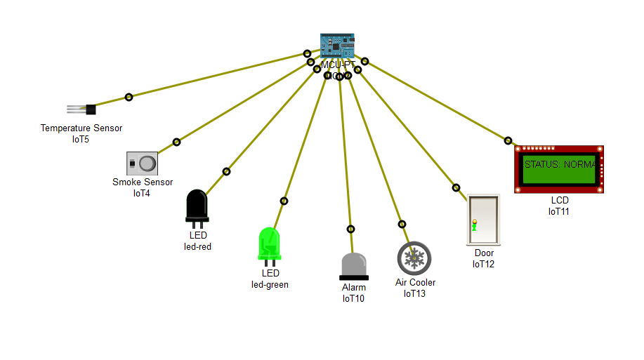
  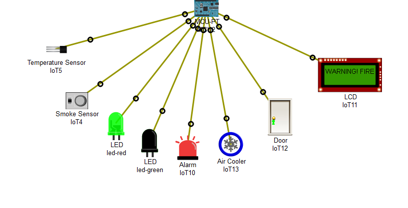
</p>

---

## ساختار مخزن (Repository)

```text
.
├─ net.pkt                                  # فایل پروژه‌ی Cisco Packet Tracer
├─ LICENSE
├─ README.md                                # انگلیسی
├─ README.fa.md                             # فارسی (این فایل)
├─ docs/
│  ├─ report.pdf                            # گزارش کامل پروژه (PDF)
│  └─ images/                               # تصاویر مستندات
└─ src/
   ├─ management-console/
   │  ├─ network-console.py                 # کنسول متنی بررسی سرویس‌ها
   │  ├─ laptop-noc-dashboard/              # برنامه‌ی داشبورد گرافیکی
   │  └─ network-console-gui/               # داشبورد گرافیکی Network Operations
   └─ bonus-disaster-recovery/
      └─ disaster-recovery-controller.py    # کنترل‌کننده‌ی اضطراری IoT (بخش امتیازی)
```

---

## جدول آدرس‌دهی (خلاصه)

| مورد | مقدار |
|------|-------|
| لینک‌های حلقه‌ی روترها | `/30` (255.255.255.252) |
| شبکه‌ی مرکز داده | `192.168.4.0/24` |
| درگاه (Gateway) مرکز داده | `192.168.4.1` |
| سرور DHCP | `192.168.4.10` |
| سرور DNS | `192.168.4.11` |
| سرور Web | `192.168.4.12` |
| سرور Mail | `192.168.4.13` |
| سرور File / FTP | `192.168.4.14` |

جدول کامل اینترفیس‌ها، تنظیمات روترها و طرح کامل آدرس‌دهی در [گزارش پروژه](docs/report.pdf) موجود است.

---

## راهنمای اجرا

۱. نرم‌افزار Cisco Packet Tracer (نسخه‌ی ۸ به بالا) را نصب کنید.
۲. فایل `net.pkt` را باز کنید.
۳. چند ثانیه صبر کنید تا OSPF همگرا شود، سپس با دستورات `ping` و `tracert` ارتباط بین ساختمان‌ها را بررسی کنید.
۴. برای کنسول مدیریت، دستگاه PC/Laptop/SBC را باز کنید و از سربرگ `Programming` برای اجرای اسکریپت‌ها یا از سربرگ `Desktop` برای باز کردن داشبوردهای گرافیکی استفاده کنید.
۵. برای بخش امتیازی، برد کنترل‌کننده‌ی IoT را باز کنید، اسکریپت را اجرا کنید، سپس مقدار دما و دود را بالا ببرید تا پاسخ اضطراری فعال شود.

> توجه: اسکریپت‌های پوشه‌ی `src` نسخه‌ی همان کدی هستند که درون دستگاه‌های Packet Tracer اجرا می‌شوند و برای مطالعه‌ی آسان‌تر اینجا قرار داده شده‌اند.

---

## تصاویر

| | |
|---|---|
| 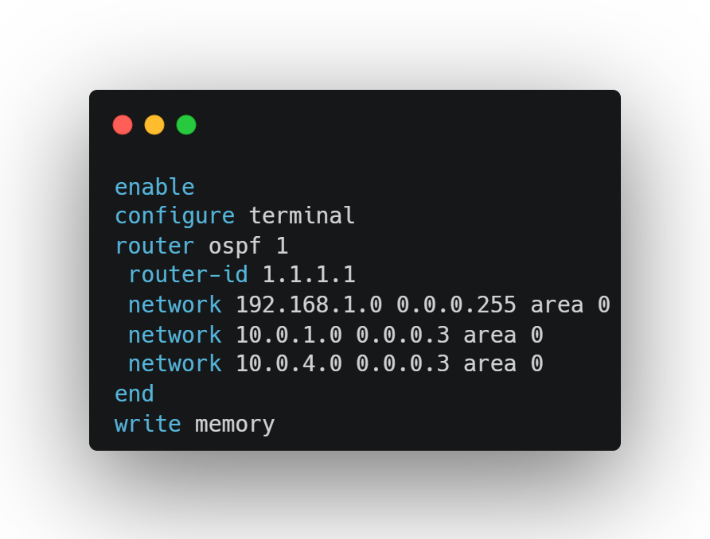 | 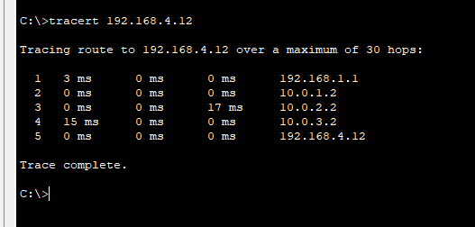 |
| پیکربندی OSPF | تست افزونگی و قطع لینک |
| 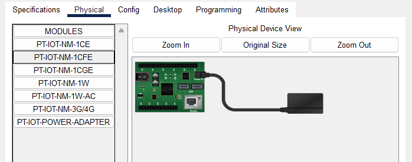 | 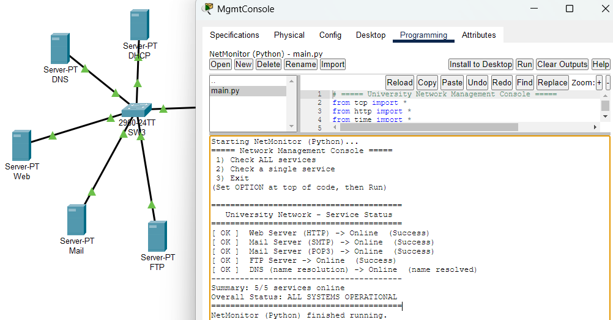 |
| صفحه‌ی اصلی سرور Web | رکوردهای DNS |
| 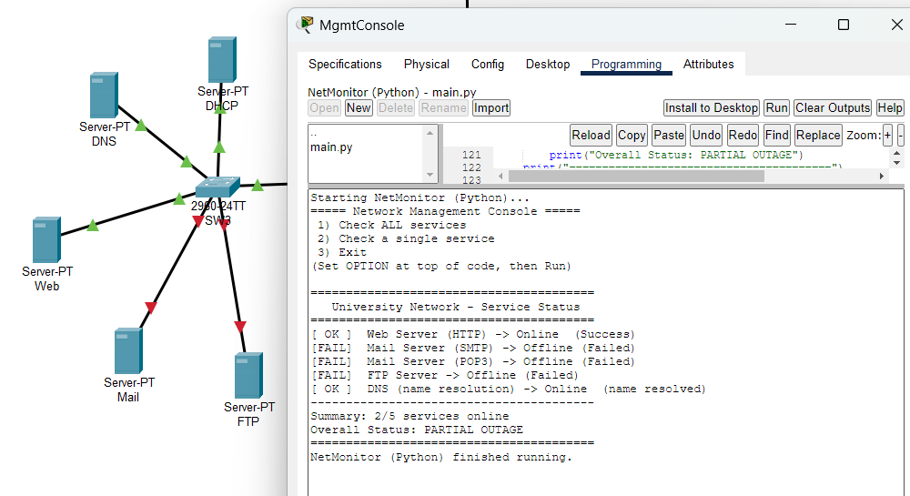 | 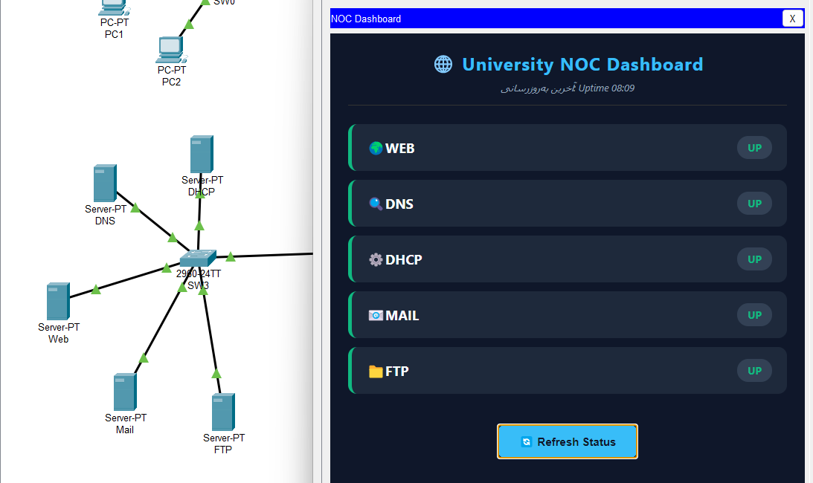 |
| کنسول متنی مدیریت شبکه | داشبورد گرافیکی |
| 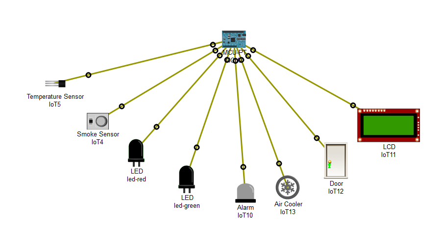 | 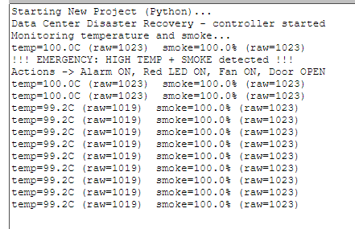 |
| چیدمان سامانه‌ی مدیریت بحران | خروجی کنترل‌کننده‌ی IoT |

---

## فناوری‌ها و مفاهیم

نرم‌افزار Cisco Packet Tracer · پروتکل OSPF · افزونگی شبکه · سرویس‌های DHCP و DNS و SMTP/POP3 و HTTP و FTP · شبکه‌ی بی‌سیم (WPA2-PSK) · اینترنت اشیا (IoT) · برنامه‌نویسی در Packet Tracer (پایتون و جاوااسکریپت)

---

## توسعه‌دهنده

**محسن نوروزی (Mohsen Norouzi)**

- گیت‌هاب: [@mohsen-norouzi237](https://github.com/mohsen-norouzi237)
- ایمیل: [mnorouzi2018@gmail.com](mailto:mnorouzi2018@gmail.com)
- لینکدین: [mohsen-norouzi](https://www.linkedin.com/in/mohsen-norouzi-143bb5336/)

> پروژه‌ی دانشگاهی درس **شبکه‌های کامپیوتری**.

## مجوز

این پروژه تحت مجوز [MIT](LICENSE) منتشر شده است.
